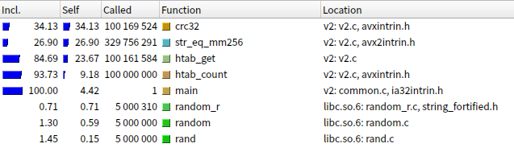

# Стеки

В данной лабораторной работе изучаются методы оптимизации на примере хэш-таблицы.

Была реальзована версия таблиц с хэшированием crc32 с методом разрешения коллизий цепочками. Таблица хранит количество включений слов.

Метод измерения производительности реализации таков: 

 - В таблицу загружаются все слова из Сильммарилиона (`data/tolkien.txt`)
 - Выполняется 5000000 поисков случайных слов (слова берутся из того же текста).
 - Замеряется время исполнения этих поисков

Время загрузки в бенчмарках не учитывается.

Сразу скажу -- пытаемся разогнать реализацию, а не улучшить алгоритм -- а так цепочки нужно было бы переписать на массивы,
но это скорее идейная оптимизация, чем техническая.

<!-- TODO: время -->

## Реализация

### Базовая версия

Скопирована с курса по алгоритмам и структурам данных. Никаких особых оптимизаций, разве что размер таблицы взят степенью двойки, чтобы номер корзины можно было определить битовой операцией.

Часть с поиском элементов реализована так:

```c

// возвращает указатель на элемент таблицы
// (нужно и при добавлении)
struct Htab_Node *htab_get(const char *word)
{
    // ... считаем crc32
    // ... выбираем корзину
    // ... итерируемся по элементам, проверяем ключ через strcmp
}

int htab_count(const char *word)
{
	struct Htab_Node *node = htab_get(word);
	return node ? node->count : 0;
}
```

Компилируем:

```bash
make res/v1
```

Замеряем то, сколько что работает.

```bash
make res/callgrind-v1.data
kcachegrind res/callgrind-v1.data
```

В аннотации видим, что:


Из этого можно понять, что главный виновник времени работы -- это `strcmp`, хотя он и с использованием `avx2`.
Оптимизируем его.

*(`-O3`) будет в конце* 

### Избавляемся от `strcmp`

Храним слова в нодах хэш-таблицы в `__m256i`, лишние байты после `\0` могут быть какими угодно.
Сравниваем их через векторные операции, взяв код из библиотечного `strcmp` ([ихсодники на github](https://github.com/lattera/glibc/blob/895ef79e04a953cac1493863bcae29ad85657ee1/sysdeps/x86_64/multiarch/strcmp-avx2.S#L101)).

Общая идея такая:

 - Имеем две строки в `a` и `b`.
 - Сравниваем их через `_mm256_cmpeq_epi8`. В результате `0` там, где исходные строки не равны.
 - Делаем `_mm256_min_epi8` этого с `a`. Таким образом `0` стоят там где либо строки не равны, либо в `a` стоит `\0`
 - Сравниваем это с `0` через `_mm256_cmpeq_epi8`, выгружаем маску в число. 
 - В маске включены те биты, на месте которых строки не равны или `\0`.
 - Проверяем что после нулевого префикса маски (там строки равны) в обоих строках стоит `\0`.
 - profit

Код этого в функции `mm256_str_eq` в файле `src/v2.c`.

Снова замеры.

```bash
make res/callgrind-v2.data
kcachegrind res/callgrind-v2.data
```



Сравнение строк ушло на второе место, теперь оптимизируем `crc32`.

### Переписываем `crc32`

Вспоминаем, что есть инструкция `crc32`, пишем с использованием неё.
Полученный код в `src/v3-crc32.s`, он подробно прокомментирован.

Компилим, меряем.

```bash
make res/callgrind-v3.data
kcachegrind res/callgrind-v3.data
```

Видим такое:


`crc32` ушло вниз, сравнение вернулось. Можно конечно снова полезть в него, но вторым пунктом
есть занимающий почти столько же поиск. Заинлайним в него сравнение, потому что просто так его
не особо переделаешь.

### Переписываем поиск

Просто берём поиск, и переписываем его на ассемблере с заинлайненным сравнением строк.
На этот раз на встроенном ассемблере компилятора.

И снова замеры.

```bash
make res/callgrind-v4.data
kcachegrind res/callgrind-v4.data
```


Видим, что наверху только что переписанный `htab_get`. Пока что останавливаемся.

## Результаты

Каждая версия запускалась по 10 раз, версии запускались поочерёдно так что влияние нагрева/изменение
частоты на них одинаковое. Замерялось время запросов, загрузка с диска не учитывалась.

По хорошему их нужно будет перемерять на более стабильном устройстве, но пока такие промежуточные результаты:


Строится так:

```
./bench.sh
python plot.py
```

Данные к этому графику в `author-time.tsv`, скрипт их пишет в `res/time.tsv`.
