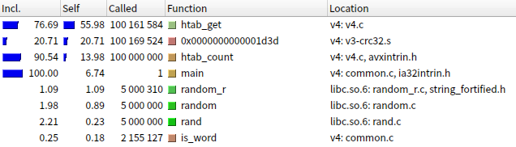

# Стеки

В данной лабораторной работе изучаются методы аппаратно-зависимой оптимизации на примере хэш-таблицы.

## Теория

### Хэш-таблицы

Хэш-таблицы используются когда есть необходимость в структуре данных, 
которая будет сопоставлять значение с ключом ("словарь"). Для словарей стандартен
набор из трёх поддерживаемых операций -- найти элемент по ключу, вставить элемент и
удалить элемент, хотя некоторые словари поддерживают и другие операции.

Есть несколько вариаций хэш-таблиц, но мы рассмотрим вариант с закрытым хэшированием.
Идея его такова:

Допустим был реализован словарь на односвязанном списке. Тогда операции реализованы
таким образом:

 - Поиск: итерируемся по списку, сравниваем ключи. Ключ совпал -- элемент найден,
   иначе если ни один не совпал, то ничего не найдено.
 - Вставка: добавляем новый элемент в конец списка
 - Удаление: находим элемент и убираем его из списка

Данная реализация крайне проста, но неэффективна -- при больших количествах элементах
на поиск может уходить время, пропорциональное количеству элементов в словаре, которое
может быть большим.

Поэтому возникла идея -- а что если разбить большой список на отдельные маленькие по
какому-то признаку, связанному с ключом? Тогда на поиск элемента в худшем случа
будет уходить количество времени пропорциональное длинне самого длинного списка,
что при правильном выборе признака можно значительно уменьшить.

Этот критерий называется *хэш-функцией* (*hash function*) от ключа, обычно связанные
списки хранятся в массиве, каждый список называют *корзиной* (*bucket*).

Если хэш-функция имеет равномерное распределение на $n$ вставленных ключах, и всего
$k$ списков, то мат. ожидание количества элементовв в каждом списке это $\frac n k$.
Данная величина называется *load factor* (*коэффициент загрузки*).

Если строить хэш-таблицу так, что коэфф. загрузки не превышает чего-то вроде $2$,
то в среднем за один поиск будет просмотрено $< 2$ элементов, что сильно лучше чем
смотреть все.

Но имеется уязвимость таких структур -- если имеется много элементов с одинаковыми
значениями хэш-функции, то в одном списке снова оказывается много элементов, и скорость
снова скатывается к тому, что было изначально. Поэтому для "небезопасных" данных
хэш-таблицы нужно использовать осторожно, не забывая про эту возможность.

### Методика измерений

В данной работе используются методы, приведённые в пособии П.В. Попова и А.А. Нозика
"Обработка результатов учебного эксперимента"[^measure-methods], также методы из
пособия Митина И.В. "Умеете ли вы правильно округлять"[^rounding-methods].

В данной работе оптимизируется **время поиска элемента в таблице**, так что
измерение направлены на это. 

Поскольку время одного поиска небольшое, измеряется время некоторого количества
операций поиска случайных ключей. Таким обазом считаем мат. ожидание времени работы
операции при случайных ключах.

Таких измерений для одного и того же набора выбираемых ключей проводится несколько
десятков, затем считается среднее время работы вставки и погрешность по формулам:

$$
    t = \mathbb{E}[T] = \frac {\sum_{i=1}^{n} t_i} n 
    \quad \Delta t_0 = 3 \sigma = 3 \sqrt{\mathbb{D}[T]}
    = 3 \sqrt{\frac{\sum_{i=1}^n (t - t_i)^2} n}
$$
$$
    T = t \pm \Delta t
$$

(где $T$ -- время работы, $t_i$ -- результаты измерений)

Погрешность взята в $3 \sigma$, таким образом вероятность попадания в данные границы
$\approx 99.7\%$. **Это верно только при нормальном распределении измерений,
но проверки данного факта в работе нет, потому что в таком случае нужно более
"продвинутые" методы измерения**.

## Архитектура программы

### Реализация таблицы

Была реальзована версия таблиц с закрытым хэшированием со строковыми ключами и
числовыми значениями. Использовано хэширование `crc32(key) % num_buckets`.

Поскольку тут задача не состоит в реализации библиотеки, хэш-таблица хранится в
статической переменной у каждой реализации. Размер таблицы фиксируется при
инициализации, перехэширование (увеличение количества корзин) не реализовано. 

В учебных целях размер выбран таким образом, чтобы load factor был в райное 15-20.
В "промышленных" версиях load factor 1.5-2, здесь он был взят высокий чтобы 
результаты оптмизаций поисков были заметны.

### Методика измерений

Последовательность действий с таблицей такова:

 - Загружаем слова из текста Сильмарилиона[^tolkien] (`data/tolkien.txt`) в таблицу
 - Проводим большое кол-во поисков случайно выбранных слов
 - Замеряем время, затраченное на поиски, считаем время затраченное на одну операцию поиска.
 - Повторяем измерения несколько десятков раз
 - Считаем среденее и ошибку.

Время загрузки в измеренном времени не учитывается, рандомные индексы слов для поиска
генерируются заранее с помощью `rand()`, так что время работы `rand()` в измерения попадает.

Замеры проводятся по 5e6 поисков, всего 20 измерений. Измерение времени выполнения проводится через `__rdtsc()`.

Обстановка измерений такая:

 - Процессор: `Intel(R) Core(TM) i5-8350U CPU @ 1.70GHz`
 - OC: `Arch Linux x86_64, Linux 6.14.3-arch1-1`
 - Компилятор: `gcc (GCC) 14.2.1 20250207`
 - Valgrind: `valgrind-3.24.0`
 - GLibc: `2.41`, отладочные символы установлены отдельно.
 - Графическая оболочка не запущена, сетевая карта выключена.

## Реализации

### Базовая версия

Реализована хэш-таблица без каких-либо оптимизаций, с 503 бакетами (коэфф. загрузки примерно 15.8). 

Часть с поиском элементов реализована так:

```c
// возвращает корзину соответствующую данному ключу
static inline size_t htab_bucket_for(const char *key)
{
	return crc32(key) % htab.num_buckets;
}

// возвращает указатель на элемент таблицы
// (нужно и при добавлении)
struct Htab_Node *htab_get(const char *word)
{
    for (
			struct Htab_Node *node = htab.buckets[htab_bucket_for(key)];
			node != NULL;
			node = node->next
	) {
		if (strcmp(node->key, key) == 0)
			return node;
	}
	return NULL;
}

int htab_count(const char *word)
{
	struct Htab_Node *node = htab_get(word);
	return node ? node->count : 0;
}
```

Сначала проведены измерения версии без флагов оптимизации:

```bash
make res/v0
./res/v0 # измеряет время
```

Получили 224 ± 2 тактов на запрос.

Затем измерения того же кода, только с добавлением флага `-O3`:

```bash
make res/v1
./res/v1 # проводит измерение времени работы

make res/callgrind-v1.data # Запускает callgrind
kcachegrind res/callgrind-v1.data
```

Получено время 166 ± 4 такта на один запрос, **ускорение программы при добавлении
`-O3` в 1.350 ± 0.023 раз.**

Продолжаем. В kcachegrind в профиле видим:


Из этого можно понять, что в первую очередь нужно оптимизировать сравнение строк.

### Оптимизируем `strcmp`

Храним слова в нодах хэш-таблицы в `__m256i`, лишние байты после `\0` могут быть какими угодно.
Сравниваем их через векторные операции, взяв код из библиотечного
`strcmp`[^glibc] ([взятые строки](https://github.com/lattera/glibc/blob/895ef79e04a953cac1493863bcae29ad85657ee1/sysdeps/x86_64/multiarch/strcmp-avx2.S#L101)).

Общая идея такая:

 - Имеем две строки в 256-битных векторных типах, в переменных `a` и `b`.
 - Сравниваем их через `_mm256_cmpeq_epi8`. В результате `0` там, где исходные строки не равны.
 - Делаем `_mm256_min_epi8` этого с `a`. Таким образом `0` стоят там где либо строки не равны, либо в `a` стоит `\0`
 - Сравниваем это с `0` через `_mm256_cmpeq_epi8`, выгружаем маску в число. 
 - В маске включены те биты, на месте которых строки не равны или `\0`.
 - Проверяем что после нулевого префикса маски (там строки равны) в обоих строках стоит `\0`.

```c
bool str_eq_mm256(__m256i a, __m256i b)
{
	__m256i diff = _mm256_cmpeq_epi8(a, b);
	__m256i min = _mm256_min_epu8(diff, a);
	__m256i not_eq_or_null = _mm256_cmpeq_epi8(min, _mm256_set1_epi8(0));

	int mask = _mm256_movemask_epi8(not_eq_or_null);
	int num_same = __builtin_ctz(mask);

	char a_byte = ((char*) &a)[num_same],
		 b_byte = ((char*) &b)[num_same];

	return a_byte == b_byte;
}
```

Проводим измерения.

```bash
make res/v2
./res/v2

make res/callgrind-v2.data
kcachegrind res/callgrind-v2.data
```

Время работы 165 ± 4 цикла на один запрос, **прирост скорости в 1.01 ± 0.03 раза** по сравнению с прошлым пунктом. **Данная оптимизация не имеет смысла.**

Но в valgrind видим такую вещь:


Сравнение строк внезапно ушло на второе место. **Судя по всему внутри valgrind время измеряется чуть по другому**. Так что оставим оптимизацию, хранение строк в `__mm256` понядобится позже.

Теперь оптимизируем `crc32`.

### Оптимизация `crc32`

На процессорах с SSE4.2 имеется аппаратное CRC32. Пользуясь им можно ускорить 
вычисление хэша.

Пишем реализацию с использованием инструкций `crc32`. Общая идея такова:

 - Считаем длинну строки векторными инструкциями
 - Выполняем последовательно несколько шагов:
   - если длинна строки больше N, то берём crc32 от N первых символов, и убираем у строки этот префикс.
   - Значениями N берём 8, 8, 8, 8, 4, 2, 1.

Полученный код в `src/v3-crc32.s`, он подробно прокомментирован.

Компилируем, измеряем:

```bash
make res/v3
./res/v3

make res/callgrind-v3.data
kcachegrind res/callgrind-v3.data
```

Время работы 148 ± 2 цикла на один запрос. **Ускорилось в 1.10 ± 0.03**, оптимизация имеет смысл.


`crc32` ушло вниз на два пункта, сравнение на первом месте. Поскольку сравнение особо не улучшишь,
пробуем улучшить то, что на втором месте. На втором месте поиск элемента.
Инлайним в него сравнение, переписываем обе эти функции на ассемблере.

### Переписываем поиск

Переписываем поиск на ассемблере с заинлайненным сравнением строк.
На этот раз на встроенном ассемблере компилятора.

Проводим измерения:

```bash
make res/callgrind-v4.data
kcachegrind res/callgrind-v4.data
```

Получилось 138.0 ± 0.9 тиков на поиск, **ускорение в 1.080 ± 0.015 раза по сравнению с прошлой версией**



Видим, что наверху только что переписанный `htab_get`. Пока что останавливаемся.

## Результаты

Итого, получены такие результаты:

| Вариант             | Среднее кол-во тиков на поиск | Ускорение отн. первой версии |
|---------------------|-------------------------------|------------------------------|
| Изначальная версия  | 224 ± 2                       | ---                          |
| Добавили `-O3`      | 166 ± 4                       | 1.350 ± 0.023                |
| Переписали `strcmp` | 165 ± 4                       | 1.37 ± 0.04                  |
| Переписали `crc32`  | 148 ± 2                       | 1.505 ± 0.024                |
| Переписали поиск    | 138.0 ± 0.9                   | 1.624 ± 0.018                |

Итого, после оптимизаций поиск получилось ускорить в **~ 1.6 раза**.

## Что использовалось

[^measure-methods]: "Обработка результатов учебного эксперимента", П.В. Попов, А.А. Нозик. https://mipt.ru/upload/Кафедра общей физики/1/lab/LabTheory_PopovNozik2024.pdf
[^rounding-methods]: "Умеете ли вы правильно округлять?", И.В. Митин, http://genphys.phys.msu.ru/rus/ofp/CanYouRound.pdf
[^tolkien]: Сильмарилион -- Д. Р. Р. Толкиен, Web archive -- https://archive.org/details/TheSilmarillionIllustratedJ.R.R.TolkienTedNasmith
[^glibc]: Исходники `glibc 2.28.9000 development` -- https://github.com/lattera/glibc/tree/895ef79e04a953cac1493863bcae29ad85657ee1
